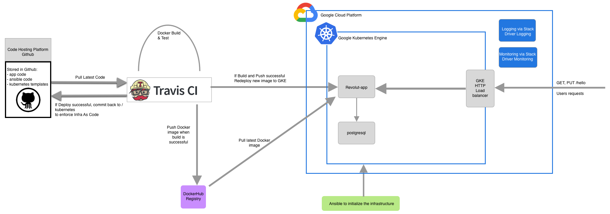

# revolut-challenge

The DevOps challenge for revolut is pretty straight forward: develop a simple API in the language of our choice respecting some stated requirements, then detail a target architecture for this API and finally implement it!

Nowadays the challenge of a devOps engineer, on top of being expert across the different domains of IT: system, networking, development, is mostly about understanding tools and choosing what is the most efficient for a given task. Hence this task is particularly interesting as it disclose what tools and why we use them.

# Tooling choice

Therefore I will quickly detailed here why I choose such tools or technology, some choices might be simply motivated because there are the tools I know the best.

### Development
 
For the language I have chosen `NodeJS` as it is straight forward to develop a small API with express and the integration with `postgresql` is quickly done. As I know that the main databases at Revolut are with postgresql, it was one of my own requirements. 

### Virtualization

I have decided to dockerize the application (along with the database), docker has many advantage such as portability, scalability. Along with it to run the local version I am using `docker-compose` which allow to spin up the stack in one command line. What is more I will use `kubernetes` for the cloud as it is the best orchestration tool for docker containers at the moment. 

### CI/CD

Although I like `Jenkins`, it feels sometimes very heavy and overkill to use it for small projects, `Travis` on the other hand is quick to set up, is hosted so no worries about resources and since it is a public project I can use freely travis.org

### Cloud Platform
 
 Lately `GCP` is my go too platform for kubernetes. as I have been working with docker/kubernetes for the past 3 years, the provisioning of a GKE cluster is much faster on Google (10 min) than in AWS with EKS (at least 20 minutes). However AWS has a lot of tools and resources that Google does not have yet 

### Provisioning

For the provisioning of the infrastructure, nowadays I have two evident choices either `terraform` or `ansible`. I have chosen the latter as I already worked with ansible to provision GKE and know it is a working combo.

### Monitoring & logging

For monitoring and logging, it depends on what we want to monitor and log but for this particular case I prefered to use the integrated module of `GCP` which is called `Stackdriver` and let you explore all the logs and set alarm on any metrics you want from your containers.

### Sum up

I will use the following tools:

```
NodeJS (8.4)
PostgreSQL
Docker
Docker-compose
Kubernetes
Travis
GCP
Ansible
Stackdriver
```

## Revolut app

As it is a NodeJS app (tested in 8.4):

`npm install` 

Run tests:

` npm test`

To run the server:

`node index.js`
 
but you will need to have a postgresql running initialized with the correct database and table format. Hence the easier is to run the docker-compose I have created. As I do not want to put environment variables inside the `docker-compose.yaml` you need to create/fill the `.app` file with your desired environment variables.

it should look like this:

```
DB_USER=postgres
DB_HOST=postgres
DATABASE=users
DB_PASSWORD=docker
DB_PORT=5432
PORT=3000
POSTGRES_DB=users
POSTGRES_PASSWORD=docker
```
Then you do and it will start the stack:

`docker-compose up -d`

You can the call the endpoint at `http://localhost:3000/hello/` to see all the entries in the database, you can also connect to the database as I am exposing the port 5432, to allow for debugging. You can test with:

`curl -X PUT -d '{"dateOfBirth":"1992-04-09"}' -H "Content-Type: application/json" localhost:3000/hello/guillaume`

then 

`curl localhost:3000/hello/guillaume`

When you want to shut it down:

`docker-compose down`

My postgresql database image is a custom one as I added the schema.sql needed to initialize the database with the proper table to contain the names and birthday dates.


## Target Architecture



Comments:

With this architecture I am trying to achieve a simple CI/CD pipeline (thanks to travis) and to enforce Infrastructure As Code by making it to commit back to Github (ideally the infra would be on a different repository than the application)
The Google Kubernetes Engine (GKE) allows us to have the advantages of kubernetes while not having to manage its components and the integrated tools of stack driver allow us to have an easy logging and monitoring.

## How to deploy 

Here are the requirements for the tools:

```
ansible 2.9.2
kubectl 1.15.2
```

### To provision via Ansible

First create an account on google cloud.
On GCP go in IAM > service accounts and create a key for the Compute Engine default service account (Edit > Create key > json), save the key on your computer. You might need to go to the kubernetes engine section to enable the API which will create the service account by default.

You will then need to export the variables where you will run the ansible script.

```
export GCP_SERVICE_ACCOUNT_FILE=/Users/guillaumedury/Downloads/revolut-263015-66268096df95.json
export GKEUSER=gduryrevolut@gmail.com
```
Modify the `ansible/vars.yml` according to your own settings, you might need to change the email, the project id or the zone.

Then you need to run:

```
ansible-playbook create-gke-cluster.yml --extra-vars "cluster_name=test"
```
This will provision the GKE cluster, it takes around 10 minutes

### To Deploy Kubernetes resources

Once the GKE cluster is provisioned, we can add the kubernetes resources. Go to the `kubernetes` directory because you will first need to verify the `app-configmap.yaml` which holds the environment variables. Example:

```
DB_HOST: postgres
DB_PORT: "5432"
PORT: "3000"
DATABASE: users
DB_USER: postgres
DB_PASSWORD: docker
PGDATA: /var/lib/postgresql/data/pgdata
```
fill this file and then and from there run:

`./deploy-app.sh`

This will apply to your cluster all the resources, the app, the postgres database and expose the revolut app via an HTTP load balancer. You can find the public IP via:

`kubectl get svc revolut-svc`

and note the `EXTERNAL-IP` which is your endpoint, exposed on port 80. We can test it and check that everything is working!

### To enable CI/CD

Once the cloud infrastructure has been deployed, we can also enable the CI/CD pipeline by reusing the credentials from the google account. It is necessary to encode the `.json` key we obtained earlier to not give away the access to our cluster. You will need to have the tool of travis to encrypt the key

`gem install travis`

then tar & encrypt the key you received from google

```
tar -cvf key.tar revolut-263015-66268096df95.json
travis encrypt-file key.tar --add
```

Then you might need to modify `.travis.yml` if your filename is different
because of the line `mv revolut-263015-66268096df95.json $HOME/gcloud-service-key.json`
Once that is done, the last step is to put your github token in the travis environment variables (job > settings) under `GITHUB_TOKEN`, you will also need `DOCKER_USERNAME` & `DOCKER_PASSWORD` to allow travis to push to docker hub new images. 

## Possible Improvements

