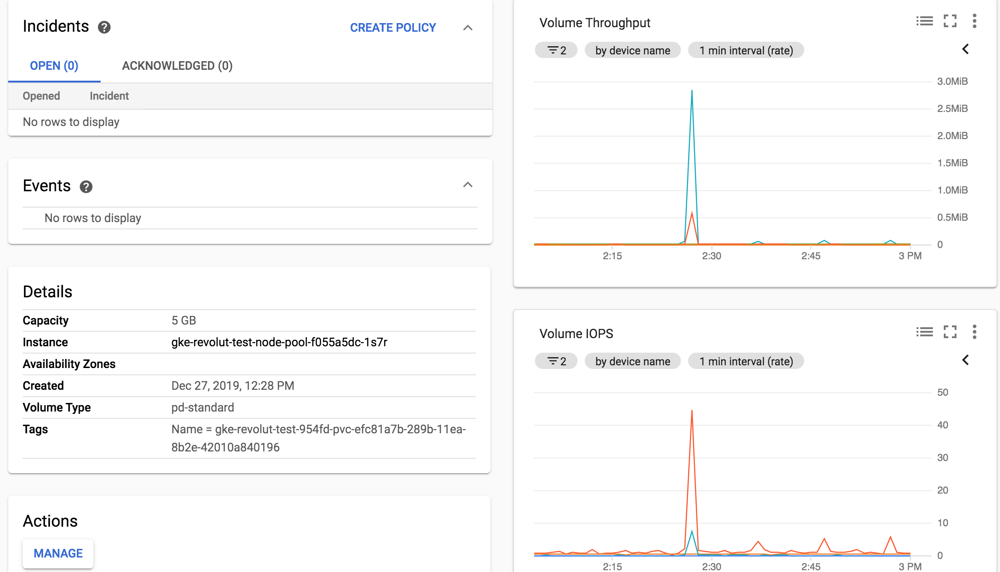

# revolut-challenge

The DevOps challenge for revolut is straight forward: develop a simple API in the language of our choice respecting some stated requirements, then detail a target architecture for this API and finally implement it!

Nowadays the challenge of a devOps engineer, on top of being an expert across different domains of IT: system, networking, development, is mostly about understanding tools and choosing what is the most efficient for a given task. Hence this challenge is particularly relevant when it comes to the work of an SRE person.  

# Tooling choice

I will quickly detail here why I choose such tools or technologies, some choices might be simply motivated because they are the tools I know the best.

### Development
 
For the language I have chosen `NodeJS` as it is straight forward to develop a small API with `express.js` and the integration with `postgresql` is quickly done. As I know that the main database at Revolut is postgresql, it was one of my own requirements. 

### Virtualization

I have decided to dockerize the application (along with the database), docker has many advantage such as portability and scalability. To run the local version I am using `docker-compose` which allow to spin up the stack in one command line. What is more I will use `kubernetes` for the cloud as it is the best orchestration tool for docker containers at the moment. 

### CI/CD

Although I like `Jenkins`, it feels sometimes very heavy to use for small projects, `Travis` on the other hand is quick to set up, is hosted so no worries about resources and since it is a public project I can use freely travis.org.

### Cloud Platform
 
Lately `GCP` is my go too platform for kubernetes. As I have been working with docker/kubernetes for the past 3 years, the provisioning of a GKE cluster is much faster on Google (10 min) than in AWS with EKS (at least 20 minutes). However AWS has a lot of tools and resources that Google does not have yet.

### Provisioning

For the provisioning of the infrastructure, nowadays we have two evident choices: `terraform` or `ansible`. I have chosen the latter as I already worked with `ansible` to provision GKE and know it is a working combo.

### Monitoring & logging

For monitoring and logging, it depends on what we want to monitor and log but for this particular case I prefered to use the integrated module of `GCP` which is called `Stackdriver` and let you explore all the logs and set alarms on any metrics you want from your containers.

### Sum up

I will use the following tools:

```
NodeJS (8.4)
PostgreSQL
Docker
Docker-compose
Kubernetes
Travis
GCP
Ansible
Stackdriver
```

## Revolut app

As it is a NodeJS app (tested in 8.4) in the `./app` folder:

`npm install` 

Run tests:

` npm test`

You will need a `.env` file with all the environment variables for the database connections info (same as `.app` described further down)
To run the server:

`node index.js`
 
but you will need to have a postgresql running initialized with the correct database and table format. Hence the easier is to run the `docker-compose` I have created. 
As I do not want to put environment variables inside the `docker-compose.yaml` you need to create/fill the `.app` and `.db` files with your desired environment variables.

it should look like this (`.app`):

```
DB_USER=postgres
DB_HOST=postgres
DATABASE=users
DB_PASSWORD=docker
DB_PORT=5432
PORT=3000
```
and one for postgres (`.db`)

```
POSTGRES_DB=users
POSTGRES_PASSWORD=docker
```
All of this is done at the root of the folder `./revolut-app`
Then you do and it will start the stack:

`docker-compose up -d`

You can the call the endpoint at `http://localhost:3000/hello/` to see all the entries in the database, you can also connect to the database as I am exposing the port 5432, to allow for debugging. You can test with:

`curl -X PUT -d '{"dateOfBirth":"1992-04-09"}' -H "Content-Type: application/json" localhost:3000/hello/guillaume`

then 

`curl localhost:3000/hello/guillaume`

When you want to shut it down:

`docker-compose down`

My postgresql database image is a custom one as I added the `schema.sql` needed to initialize the database with the proper table to contain the names and birthday dates schema.


## Target Architecture


With this architecture I am trying to achieve a simple `CI/CD` pipeline (thanks to travis) and to enforce `Infrastructure As Code` by committing back to Github; ideally the infra would be on a different repository than the application).
The Google Kubernetes Engine (GKE) allows us to have the advantages of kubernetes while not having to manage its components and the integrated tools of `stackdriver` allow us to easily have logging and monitoring.

## How to deploy 

Here are the requirements for the tools:

```
ansible 2.9.2 (need python)
kubectl 1.15.2
```

### To provision via Ansible

First create an account on google cloud.
On GCP go in IAM > service accounts and create a key for the Compute Engine default service account (Edit > Create key > json), save the key on your computer. You might need to go to the kubernetes engine section to enable the API which will create the service account by default.

You will then need to export the variables where you will run the ansible script.

```
export GCP_SERVICE_ACCOUNT_FILE=/Users/guillaumedury/Downloads/revolut-263015-66268096df95.json (path to your key file)
export GKEUSER=gduryrevolut@gmail.com (email used for the google account)
```
Modify the `ansible/vars.yml` according to your own settings, you might need to change the email, the project id or the zone.

Then you need to run (inside `./ansible`):

```
ansible-playbook create-gke-cluster.yml --extra-vars "cluster_name=revolut-test"
```
This will provision the GKE cluster, it takes around 10 minutes.
You can verify your cluster is properly running by using:

`kubectl get pods --all-namespaces`

### To Deploy Kubernetes resources

Once the GKE cluster is provisioned, we can add the kubernetes resources. Go to the `./kubernetes` directory and verify the `app-configmap.yaml` which holds the environment variables and the `app-secret.yaml` which holds the secret for postgres user and password. Example:

```
DB_HOST: postgres
DB_PORT: "5432"
PORT: "3000"
DATABASE: users
PGDATA: /var/lib/postgresql/data/pgdata
```
fill this file 
for the `app-secret.yaml` you need to encode in base64 your credentials:

`echo -n 'postgres' | base64`

and then fill `app-secret.yaml` for example:

```
data:
  user: cG9zdGdyZXM=
  password: ZG9ja2Vy
```

from there run:

`./deploy-app.sh`

This will apply to your cluster all the resources, the app, the postgres database and expose the revolut app via an HTTP load balancer. You can find the public IP via:

`kubectl get svc revolut-svc`

and note the `EXTERNAL-IP` which is your endpoint, exposed on port 80. We can test it and check that everything is working!

### To enable CI/CD

Once the cloud infrastructure has been deployed, we can also enable the CI/CD pipeline by reusing the credentials from the google account. It is necessary to encode the `.json` key we obtained earlier to not give away the access to our cluster. You will need to have the tool of travis to encrypt the key:

`gem install travis`

then tar & encrypt the key you received from google:

```
tar -cvf key.tar revolut-263015-66268096df95.json
travis encrypt-file key.tar --add
```

Then you might need to modify `.travis.yml` if your filename is different
because of the line `mv NAME.json $HOME/gcloud-service-key.json`
Once that is done, the last step is to put your github token in the travis environment variables (job > settings) under `GITHUB_TOKEN`, you will also need `DOCKER_USERNAME` & `DOCKER_PASSWORD` to allow travis to push to docker hub new images. 

Once this is done, if you commit a change to the repository, then it will automatically build and push to docker hub the new docker image and deploy it to the Kubernetes engine with the new tag. On top of that the travis script will commit back to github to ensure we keep the tag of the new image in the code and are able to use it in future deployments.

### Logging and monitoring

Concerning the logging, stackdriver is taking care of the centralized logging for us. You just need to go to `Stackdriver > Logging` and there we can access all the logs of our containers in Logs Viewer

Concerning the monitoring, with such an API, there are a few metrics to watch to ensure the application is properly running:

* CPU/Memory usage on the revolut-app container
* CPU/Memory usage on postgres container
* Postgresql Disk size 
* Number of requests 

You can watch the metrics in `Stackdriver > Monitoring > Monitoring Overview`.
It is possible to set up alerting in stackdriver very easily, you go to 
Alerting then create policy, choose your metrics and set up an alert. Since the disk for postgresql is 5 Gb, we can set up an alert at 4.5 Gb to ensure we are notified if the disk is getting filled by data.

Example of monitoring disk metrics:



## Possible Improvements

This architecture is for me more a proof-of-concept to show what I can do as a Devops/SRE engineer and the tools I am familiar with. I will detail here a few  axis of improvements to bullet proof this system and make it more production ready.

### Branching strategy

I did not take into any branching strategy for the CI/CD nor the deployment part, considering only master branch and a unique environment. In reality (in a software development team) this can be different as we would use other branches and other environment (such as staging, uat) to ensure users can test the software before releasing to production.  

### Scalability

This system is currently scalable to a certain point. One solution could be to add Horizontal Pod Autoscaler resources in Kubernetes to ensure that Kubernetes spawn new pods in the `revolut-app` in case of high usage in terms of resources (CPU/Memory) combined with an auto-scaling in terms of nodes in the GKE settings. This would ensure that the system will accept a high number of connections. 

### Endpoint

The endpoint of the revolut app is currently totally exposed to the outside via a public IP given by GCP. As a best practice I would put the revolut app behind a reverse proxy such as Nginx to control exactly what kind of endpoints are exposed. What is more having Nginx in front would allow us to have SSL termination to enhance the security of the communication of our users with the app (and the SEO at the same time)

### Security 

In terms of security, we could, as I was saying earlier add SSL termination via  Let's encrypt for example. What is more, secrets in kubernetes are not very well protected (only base64 encoded) so we could use a stronger secret management platform such as `Vault` to securely encrypt environment variables and secret that requires it. 

# Conclusion

I hope you will enjoy this work as much as I enjoyed working on it. I love to create infrastructures and system that are scalable and at the same time simplified enough so that developers can work on it.

